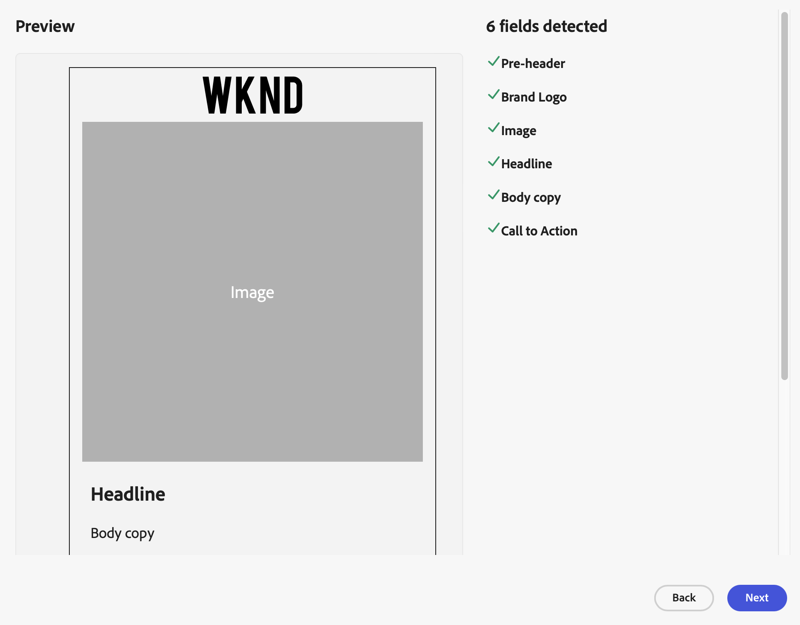

# Personalizar una plantilla

Adapte las plantillas de HTML para el Adobe GenStudio para los especialistas en marketing de rendimiento mediante el lenguaje de plantilla _Handlebars_. La sintaxis [!DNL Handlebars] utiliza texto normal con llaves dobles como marcadores de posición de contenido. Consulte [`What is [!DNL Handlebars]?`](https://handlebarsjs.com/guide/#what-is-handlebars) en la _Guía de idioma de Handlebars_ para aprender a preparar la plantilla.

En las siguientes secciones se explica cómo agregar marcadores de posición de contenido, ocultar elementos innecesarios de la vista previa y administrar vínculos a contenido estático. Una vez que la plantilla esté lista, puede [cargarla en GenStudio para especialistas en marketing de rendimiento](use-templates.md#upload-a-template) y empezar a generar correos electrónicos personalizados basados en la plantilla personalizada.

## Marcadores de contenido

GenStudio para especialistas en marketing de rendimiento reconoce ciertos [elementos](use-templates.md#template-elements) dentro de una plantilla, pero solo si los identifica con un nombre de campo reconocido.

Dentro del encabezado o del cuerpo de una plantilla, puede usar la sintaxis [!DNL Handlebars] como marcador de posición de contenido donde necesite que GenStudio para especialistas en marketing de rendimiento rellene la plantilla con contenido real. GenStudio para especialistas en marketing de rendimiento reconoce e interpreta los marcadores de posición de contenido en función del [nombre de campo _reconocido_](#recognized-field-names).

Por ejemplo, puede usar `{{ headline }}` con la sintaxis [!DNL Handlebars] para indicar dónde se debe colocar el titular del correo electrónico:

```handlebars
<div>{{headline}}</div>
```

### Nombres de campo reconocidos

En la tabla siguiente se enumeran los nombres de campo reconocidos por GenStudio para Performance Marketers para su rellenado en plantillas. Agregue estos nombres de campo utilizando la sintaxis [!DNL Handlebars] a la plantilla donde necesite que GenStudio para los especialistas en marketing de rendimiento genere contenido.

| Campo | Función | Plantilla de canal |
| -------------- | ---------------------- | ------------------------------ |
| `pre_header` | Encabezado previo | email |
| `headline` | Titular | Enviar correo electrónico a <br>Meta ad |
| `body` | Copia de cuerpo | Enviar correo electrónico a <br>Meta ad |
| `cta` | Llamada a la acción | Enviar correo electrónico a <br>Meta ad |
| `on_image_text` | En texto de imagen | Meta anuncio |
| `image` | Imagen | Enviar correo electrónico a <br>Meta ad |
| `brand_logo` | Logotipo de la marca seleccionada<br>Consulte [Nombre del campo del logotipo de la marca](#brand-logo-field-name) para ver el uso recomendado. | correo electrónico<br>Meta anuncio |

GenStudio para especialistas en marketing de rendimiento rellena ciertos campos automáticamente en las siguientes plantillas:

- **La plantilla de correo electrónico** no requiere que identifique el campo `subject`
- **La plantilla Meta Ads** no requiere que identifique los campos `headline`, `body` y `CTA`

<!--
- **Display Ads template** does not require you to idenitify the `CTA` field
-->

>[!WARNING]
>
>En el caso de los anuncios de Instagram, el titular generado no aparece en la experiencia final.

Hay un límite de 20 campos al cargar una plantilla en GenStudio para especialistas en marketing de rendimiento. Dado que el campo `subject` se genera automáticamente en un mensaje de correo electrónico, se cuenta como un campo. Esto significa que hay 19 campos permitidos en una plantilla de correo electrónico.

>[!TIP]
>
>Puede comprobar la plantilla con la [vista previa de la plantilla](#template-preview) en GenStudio para especialistas en marketing de rendimiento.

#### Nombre del campo del logotipo de marca

En este momento, no puede seleccionar el logotipo de la marca para cargar la plantilla. Los siguientes ejemplos muestran dos métodos que representan de forma condicional el logotipo de la marca. Cada método verifica el origen, proporciona una imagen predeterminada o alternativa en caso de que el logotipo de la marca no esté disponible y aplica un estilo:

**Ejemplo 1**: Se usa la condición [!DNL Handlebars] de los ayudantes integrados directamente en el atributo del HTML `img src`:

```html
{{/if}}" alt="img alt text" style="max-width: 88px; margin: 10px auto; display: block;">
```

**Ejemplo 2**: Se usa [!DNL Handlebars] instrucción de condición integrada para envolver la etiqueta de HTML `img`:

```handlebars
{{#if brand_logo}}
    
    {{else}}
    
{{/if}}
```

#### Nombres de campo manuales

Todos los demás nombres de campo se tratan como campos rellenados manualmente.

Para crear una sección editable, agregue corchetes dobles alrededor del nombre de la sección:

```handlebars
{{customVariable}}
```

### Secciones o grupos

_Las secciones_ informan a GenStudio para especialistas en marketing de rendimiento de que los campos de esta sección requieren un alto grado de coherencia. El establecimiento de esta relación ayuda a la IA a generar contenido que coincida con los elementos creativos de la sección.

Utilice un prefijo de su elección en el nombre del campo para indicar que un campo forma parte de una sección o grupo. Por ejemplo, es posible que desee resaltar el contenido que aparece en un área resaltada:

- `spotlight_headline`
- `spotlight_body`

Cada sección solo puede utilizar uno de cada tipo de campo. En el ejemplo anterior, la sección `spotlight` solo puede usar un campo `spotlight_headline`.

Una plantilla puede incluir hasta tres secciones:

- `headline`
- `body`
- `spotlight_headline`
- `spotlight_body`
- `news_headline`
- `news_body`

GenStudio para especialistas en marketing de rendimiento entiende que `spotlight_headline` está más relacionado con `spotlight_body` que con `news_body`.

## Previsualización de plantilla

Cuando [sube una plantilla](use-templates.md#upload-a-template), GenStudio for Performance Marketers busca campos reconocidos en el archivo del HTML. Use la vista previa para revisar los [elementos de plantilla](use-templates.md#template-elements) y confirmar que los identificó correctamente con los [nombres de campo reconocidos](#recognized-field-names).

Ejemplo de previsualización para una plantilla de correo electrónico:

{width="650"}

### Previsualización de control

Puede controlar la visibilidad del contenido especial mediante los Ayudantes integrados (expresiones especiales en el lenguaje de plantilla [!DNL Handlebars] que realizan determinadas acciones). Por ejemplo, se puede añadir una sentencia condicional que añada parámetros de seguimiento a los vínculos en la plantilla exportada, manteniendo limpios los vínculos de vista previa.

El valor `_genStudio.browser` se establece al procesar una plantilla y el valor `genStudio.export` se establece al exportar una plantilla. Puede decidir incluir cierto contenido en la parte superior de un correo electrónico mediante un envoltorio condicional, por ejemplo, cuando la plantilla se utiliza para la exportación:

```handlebars
{{#if _genStudio.export}}
<%@ include view='emailParent' %>
{{/if}}
```

Otro ejemplo puede ser evitar el uso de códigos de seguimiento al obtener una vista previa de una plantilla en GenStudio para especialistas en marketing de rendimiento. El siguiente ejemplo muestra cómo añadir parámetros de seguimiento a los vínculos en la plantilla exportada, manteniendo limpios los vínculos de vista previa:

```handlebars
<a class="button" {{#if _genStudio.browser }}
   href="{{ link }}"{{/if}}{{#if _genStudio.export }}
   href="{{ link }}?trackingid=<%=getTrackingId()%>&mv=email"{{/if}}
   target="_blank">{{ cta }}</a>
```

## Contenido estático

Las plantillas de correo electrónico y metadatos suelen vincularse a imágenes y archivos CSS alojados fuera de GenStudio para especialistas en marketing de rendimiento. Cuando GenStudio para especialistas en marketing de rendimiento genera miniaturas para estas plantillas o las experiencias derivadas de ellas, puede ignorar estos recursos externos si no tienen los encabezados correctos de Intercambio de recursos de origen cruzado (CORS).

Para asegurarse de que estos recursos están disponibles durante el proceso de generación de miniaturas, tenga en cuenta dos opciones:

1. **Usar encabezados CORS**: El servidor host debe enviar respuestas con un encabezado `Access-Control-Allow-Origin` establecido en `https://experience.adobe.com` como valor para entornos de producción. Este método permite a GenStudio para especialistas en marketing de rendimiento acceder e incluir los recursos.

1. **Usar URL de datos**: incruste los recursos externos directamente en la plantilla mediante URL de datos. Este método evita las restricciones CORS y garantiza que los recursos estén disponibles durante la generación de miniaturas.

## Ejemplos de plantillas

+++Ejemplo: Plantilla de correo electrónico con una sección

El siguiente es un ejemplo básico de una plantilla de HTML para un correo electrónico que contiene una sección. El encabezado contiene CSS en línea simple para el estilo. El cuerpo contiene `pre-header`, `headline` y `image` [marcador de posición](#content-placeholders) que GenStudio usará para que los especialistas en marketing de rendimiento inyecten contenido durante el proceso de generación de correo electrónico.

```handlebars {line-numbers="true" highlight="13"}
<!DOCTYPE html>
<html>
<head>
    <title>Adobe</title>
    <style>
        .container {
            width: 100%;
            padding: 20px;
            font-family: Arial, sans-serif;
        }
    </style>
</head>
<body>{{ pre_header }}
    <div class="container">
        <h1>{{ headline }}</h1>
        <p></p>
        <p>{{ body }}</p>
    </div>
</body>
</html>
```

+++

+++Ejemplo: Plantilla de correo electrónico con varias secciones

La siguiente es la misma plantilla de HTML en el ejemplo anterior, pero con dos secciones más. El encabezado contiene CSS en línea para aplicar estilo a un grupo. El cuerpo usa dos grupos con [marcadores de posición de contenido](#content-placeholders) con un prefijo.

```handlebars {line-numbers="true" highlight="33"}
<!DOCTYPE html>
<html>
<head>
    <title>Adobe</title>
    <style>
        .container {
            width: 100%;
            padding: 20px;
            font-family: Arial, sans-serif;
        }
        .pod {
            background-color: #f8f8f8;
            margin: 10px;
            padding: 20px;
            border-radius: 5px;
        }
        .pod h2 {
            color: #333;
        }
        .pod p {
            color: #666;
        }
    </style>
</head>
<body>{{ pre_header }}
    <div class="container">
        <h1>{{ headline }}</h1>
        <p></p>
        <p>{{ body }}</p>
        <div class="pod">
            <h2>{{ pod1_headline }}</h2>
            <p>This is Pod 1 content.</p>
        </div>
        <div class="pod">
            <h2>{{ pod2_headline }}</h2>
            <p>This is Pod 2 content.</p>
        </div>
    </div>
</body>
</html>
```

+++

+++Ejemplo: plantilla de meta-anuncio

El siguiente es un ejemplo básico de una plantilla de publicidad Meta. El encabezado contiene CSS en línea para el estilo. El cuerpo usa [marcadores de posición de contenido](#content-placeholders) con un prefijo.

```handlebars {line-numbers="true" highlight="33"}
<!DOCTYPE html>
<html>
<head>
    <meta charset="UTF-8">
    <meta name="viewport" content="width=device-width, initial-scale=1.0">
    <title>Adobe</title>
    <style>
        .ad-container {
            width: 300px;
            border: 1px solid #ddd;
            padding: 16px;
            font-family: Arial, sans-serif;
        }
        .ad-image {
            width: 100%;
            height: auto;
        }
        .ad-headline {
            font-size: 18px;
            font-weight: bold;
            margin: 12px 0;
        }
        .ad-body {
            font-size: 14px;
            margin: 12px 0;
        }
        .ad-cta {
            display: inline-block;
            padding: 10px 20px;
            background-color: #007bff;
            color: #fff;
            text-decoration: none;
            border-radius: 4px;
            text-align: center;
        }
    </style>
</head>
<body>
<div class="ad-container">
    
    <div class="ad-headline">"{{ headline }}"</div>
    <div class="ad-body">"{{ body }}"</div>
    <a href="(https://example.com)" class="ad-cta">"{{ CTA }}"</a>
</div>
</body>
</html>
```

+++

